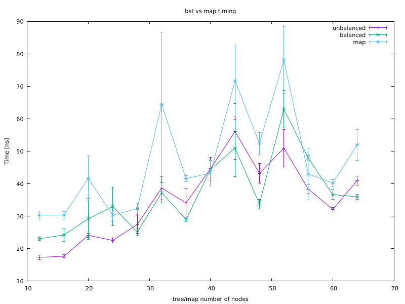
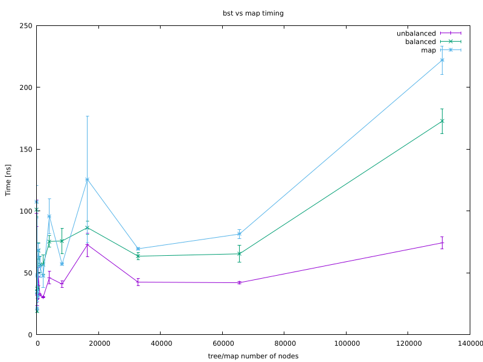

## Exam Report - P1.3_seed (C++) 

In the folder I uploaded the following files:

- `bst.hpp`, containing the C++ implementation of a  binary search tree; 
- `benchmark.cpp`, containing a C++ file which is used to measure the performance of the find() method for our binary search tree (unbalanced and balanced) and for std::map;
- `makefile`, which is used to compile the files;
- `mean_std.awk`, an awk script which computes mean and standard deviation of data contained in a single-column file;
- `actions.sh` and `actions_small.sh`, bash scripts which run the benchmark for big and small tree/map and produces three data files (for unbalanced tree, balanced tree, std::map each) containing mean and standard deviation for our measurements; 
- `plot.gnu`, `plot_small.gnu`, gnuplot scipts used to generate the plots.

In addition there are two plots `timing.png` and `timing_small.png` generated with our scripts.

### Compilation and running

Compilation of the files is simply done by running the `make` command (`make clean` to remove object files and executables).

The executable `benchmark.x` requires an argument from command-line representing the number of nodes in the tree and std::map: e.g. we can run `./benchmark.x 100` will run the tests for a tree and std::map with 100 nodes (of random int keys and int values). The output will be three sets of 11 time measurements for the find() method (for unbalanced tree, balanced tree, std::map each).

The bash scripts can be simply used by running `./actions.sh` or `./actions_small.sh`. 

The gnuplot scripts can be used by running `gnuplot plot.gnu` or `gnuplot plot_small.gnu`.

**Remark**: testing with valgrind can be done e.g. as follows:

`valgrind --leak-check=full --verbose --show-leak-kinds=all ./benchmark.x 100`

### Binary tree implementation

The binary tree bst class is implemented based on a new type (struct) Node, which contains:
- a std::pair of templated (key, value) data;
- two std::unique_ptr which can be used to point to a left or right Node in a bst;
- a raw pointer which can be used to point to a parent Node in a bst.

The bst class itself contains instead:
- a std::unique_ptr to the root Node (of templated key, value);
- a templated comparison functions (used to compare templated keys of the bst Nodes), which defaults as std::less.

All methods for the bst requested by the exercise were implemented. 

### Benchmark

The `benchmark.x` executable runs a few tests to evaluate the time needed for the find() method to traverse a bst (unbalanced or balanced) or a std::map. Ideally, the time needed should follow a log_2(N) behaviour, where N is the number of nodes in the tree / std::map. 

In the first plot, generated by `actions_small.sh` and `plot_small.gnu`, it is shown the obtained timings for small N, where the log_2(N) expected increasing behaviour should be more visible:

 

The increasing behaviour seems indeed present, but the fluctuations are too big to compare it against a log_2(N) behaviour. 

In the second plot, generated by `actions.sh` and `plot.gnu`, it is shown the obtained timings for large N, where the log_2(N) expected behaviour is constant:

 

From the plot instead we see a general increasing behaviour after a certain N, but actually the resulting plot varies a lot depending on the run. It is therefore quite hard to really establish the behaviour of the find() method; having more time, it may be interesting to study this problem further.
